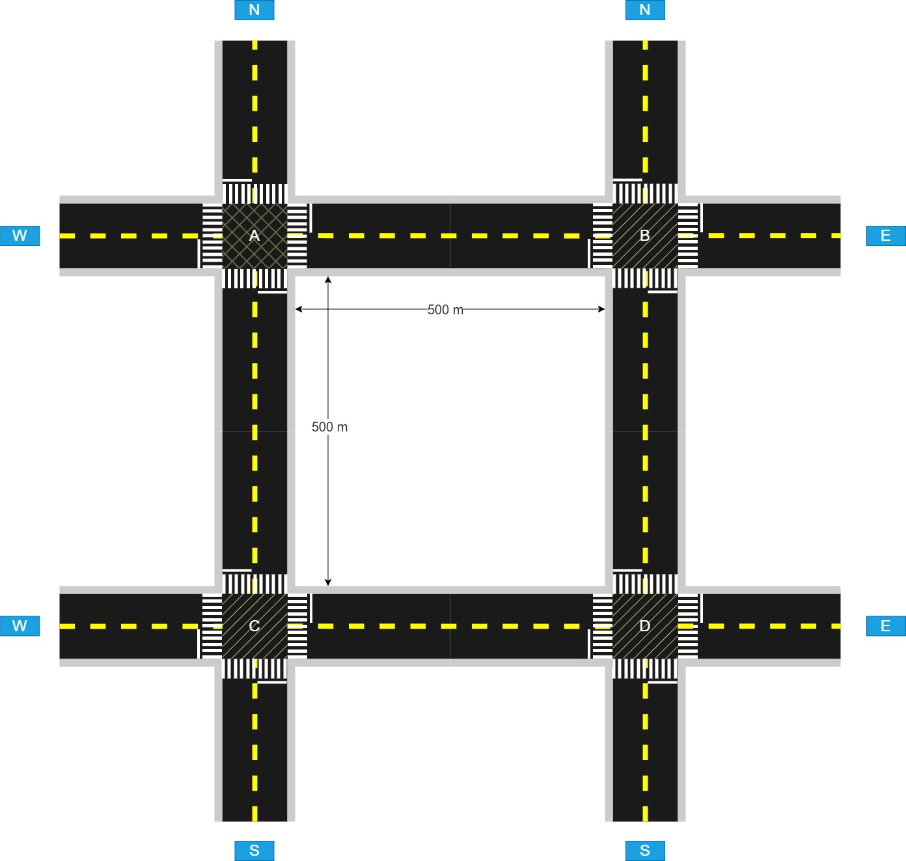
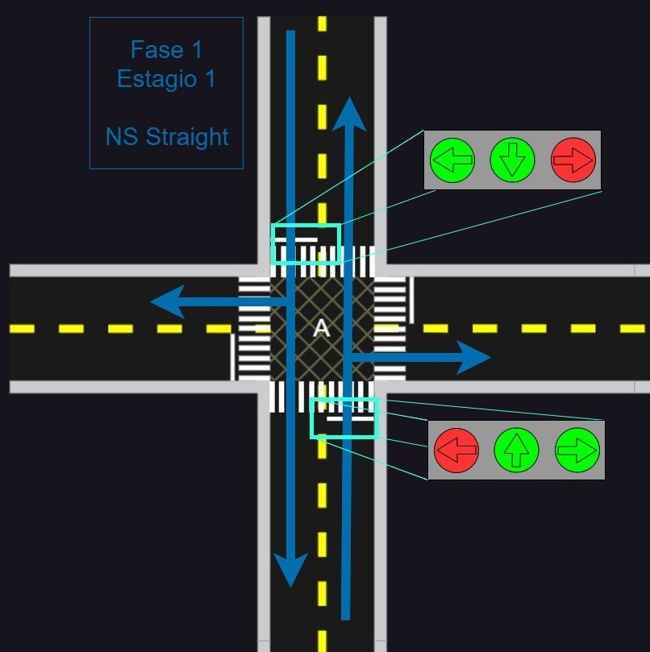
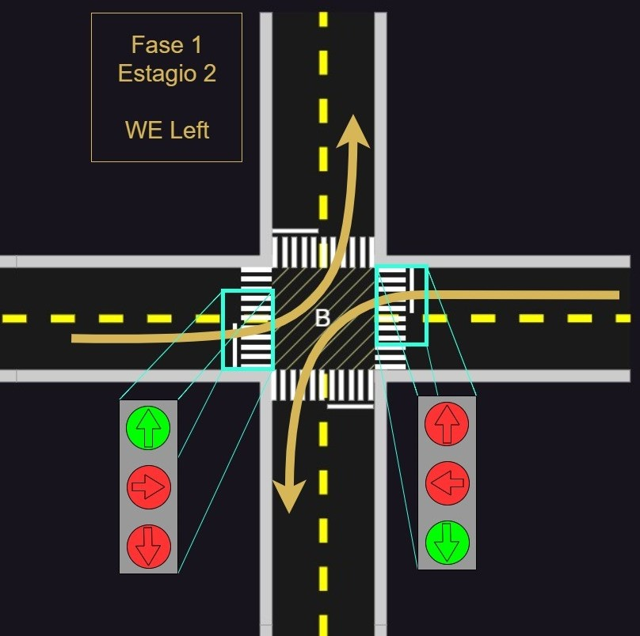

## RTS - Urban Traffic Simulation
Simulação de tráfego urbano

### Cenário de simulação
O cenário de simulação consiste de uma zona urbana composta por quatro cruzamentos interligados em matriz 2x2 conforme indicado na figura abaixo:



Os sentidos cardiais adotam a primeira letra da nomenclatura em inglês:
- N: North (Norte)
- S: South (Sul)
- E: East  (Leste)
- W: West  (Oeste)

Os quatro cruzamentos (A, B,C, D) são sinalizados em todas as direções, e se comportam seguindo um conjunto de fases que permite a passagem dos veículos no trajeto.

### Detalhes




* OBSERVAÇÃO: As sinalizações estão presentes em cada um dos sentidos do cruzamento, e foram ocultadas do desenho os semáforos que estão fechados para todas as sentidos.


### Instalação

Para executar a solução no Visual Studio:
1. Baixe e Descompacte o FreeRTOSv10.0.1.
2. Renomeie a pasta  FreeRTOSv10.0.1 para FreeRTOS.
3. Apague o demo padrão na pasta FreeRTOS\Demo\WIN32-MSVC.
4. Clone este repositório.
5. Copie os arquivos descompactados para dentro da pasta raiz do repositório.
    ```
    <Repo>\FreeRTOS
    <Repo>\FreeRTOS\FreeRTOS
    <Repo>\FreeRTOS\FreeRTOS\Demo\WIN32-MSV (Este Projeto)
    <Repo>\FreeRTOS\... (Demais arquivos)
    <Repo>\FreeRTOS\FreeRTOS-Plus
    ```
6. Abra a solução Visual Studio `<Repo>\FreeRTOS\Demo\WIN32-MSVC\WIN32.sln`
7. Compile o projeto.
8. Copie e cole os .dll  (`WIN32-MSV\Lib\<Libs>\libx86\<dependência>.dll`) dentro de `WIN32-MSV\Debug\` ou `WIN32-MSV\Release\`.
9. Execute a solução.

### Dependências
* SDL2 [2.30.8]
* SDL2 image [2.8.2]
* SDL2 ttf [2.22.0]

### Referências
???